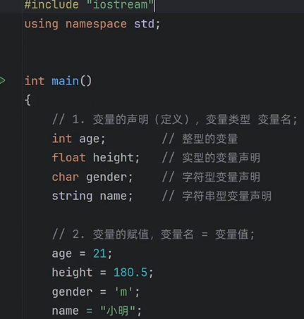

## 260912
- 为什么`#ifdef`和`#endif`在main内要顶格？一定要吗？代码风格？缩进写也可以运行
    ```
    #include <iostream>
    #ifdef _WIN32
    #include <windows.h>
    #endif

    int main(){
    #ifdef _WIN32
        SetConsoleOutputCP(CP_UTF8);
    #endif

        std::cout << "你好呀 \n 我喜欢你" << std::endl;
        return 0;

    }
    ```
- `#ifdef _WIN32`和`#if defined(_WIN32)`区别是？一个简写/一个全写？推荐写哪种？
- 为什么c语言的字符数组形式字符串不可通过赋值进行更改？其他更改方法是？
    ```
        int main(){

        // c语言风格字符串
        char s1[] = "I love c++";      //字符数组的形式
        char *s2 = "python ";       //指针的形式

        // c++语言风格的字符串
        std::string s3 = "c++ string";

        // 赋值修改
        // s1 = "666"; // 不可更改变量值，只读
        s2 = "777";
        s3 = "888";

        std::cout << s1 << std::endl;
        std::cout << s2 << std::endl;
        std::cout << s3 << std::endl;


        return 0;

    }
    ```
- 如果对比的两个字符串至少有1个是string类型,可以使用运算符比较;c++对string类型参与的运算符进行重载

## 260910 
- `#include <iostream>` 和`#include “iostream”`区别
    - <> ：系统/标准库->自定义包含路径，c++标准头文件以及第三方系统库
    - “”：当前源文件所在目录->项目包含目录->系统/标准库目录，项目内部自定义的头文件

- 符号常量为什么通常定义在头部？
    - 不一定在头部；类似于python全局变量/局部变量

- 为什么使用【string name = "张三"; 】报错；使用【std::string name = "张三"; 】没有问题


    - 在 C++ 中，为了防止全局命名冲突，标准库的所有类、函数和变量都被打包在一个名为 std 的命名空间（Standard Namespace）中。string 不是 C++ 语言内置的基本数据类型（如 int、char、double），而是标准库提供的类模板类型。


## 260908《std:: 与 using namespace 及 #include 两种写法的区别》
```
#include <iostream>

int main() {
    std::cout << "Hello, World!" << std::endl;
    return 0;
}

```

```
#include "iostream"
using namespace std;

int main() {
    cout << "Hello, World!" << endl;
    return 0;
}
```

- 头文件查找方式：<iostream> 优先从系统标准库路径查找（效率高且规范）；"iostream" 会先在当前项目目录查找，找不到再去标准库，通常仅用于引入自己写的头文件。

- 命名空间使用：代码一使用 std:: 显式指定，更安全，防代码重名冲突；代码二用 using namespace std; 展开全局，容易在复杂项目中导致名称污染与冲突。

- 代码书写风格：代码一是标准规范的工程写法；代码二是加了详细解释的初学者教学写法。


## 260907 namespace是什么？作用是？

https://www.runoob.com/cplusplus/cpp-namespaces.html